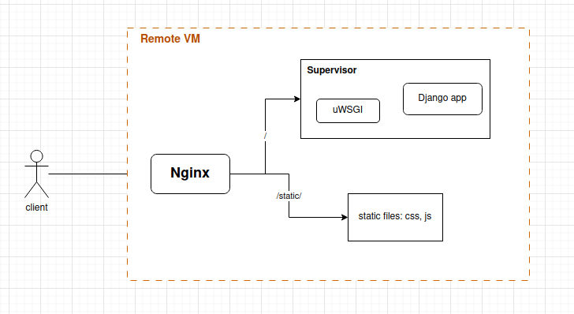

# My Example Django App for learning CI/CD# django-app-aws

## Deployments

### Deploy a local dev environement

In order to deploy a local dev environement, run `make setup_dev`.
This command will:

1. Create a virtualenv called `venv` in the root directory of the project.
2. `pip` install all dependent Python packages.

This option does not try to run the web application using any web server.


### Deploy to a VM (e.g.: AWS EC2) environment

To deploy this app to a remote VM, run:

```
sudo make prepare_vm        # install dependent softwares/libraries
make config_vm              # do initial configuration
sudo make deploy_vm         # deploy the web server
```

The current web server architecture is the following:

